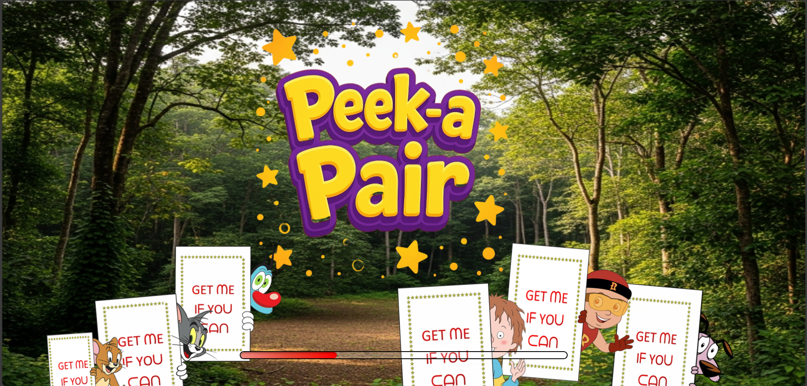
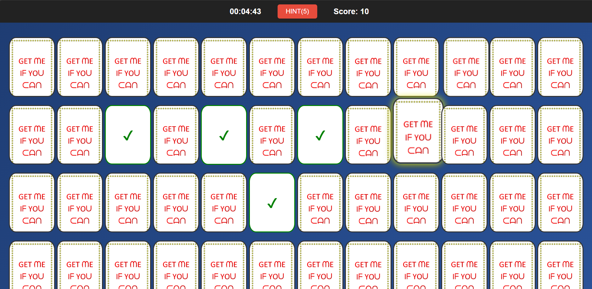
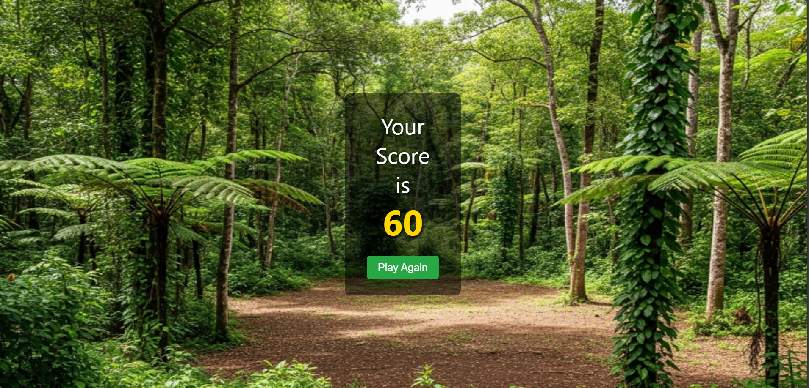

# 🎴 Peek-a-Pair  

Peek-a-Pair is an **interactive memory card-matching game** built with **HTML, CSS, and JavaScript**.  
🔄 Flip cards, find matching pairs 🎯, and score points 🏆 as you test your **memory and focus**.  

🎮 **[▶️ Play the Game!](https://atmajoburman.github.io/Peek-a-Pair/)**  

---

## 🚀 Features  

- 🎴 **Interactive Gameplay** – Dynamic card-flipping with animations.  
- 🏆 **Scoring System** – Tracks moves and performance to encourage improvement.  
- 📱 **Responsive Design** – Works across devices (mobile, tablet, desktop).  
- 🎨 **Intuitive UI/UX** – Clean, minimal, distraction-free interface.  
- ⚡ **Lightweight** – Built only with HTML, CSS, and Vanilla JavaScript (no frameworks).  

---

## 🛠️ Technologies Used  

- **HTML5** → Game structure & content  
- **CSS3** → Styling, animations, responsiveness  
- **JavaScript (ES6+)** → Core logic (shuffling, flipping, matching, scoring)  

---

## ⚙️ How to Play  

1. Click on a card to flip it over.  
2. Flip another card.  
   - ✅ If they match → both stay open.  
   - ❌ If they don’t match → both flip back.  
3. Continue until all pairs are matched.  
4. Try to finish with the **fewest moves & hints** possible!  

---

## 📸 Screenshots  

| Intro Screen | Gameplay | Outro Screen |  
|--------------|----------|--------------|  
|  |  |  |  

---

## 📌 Upcoming Enhancements  

- 🎵 **Sound effects** for flipping and matching  
- 🏅 **High Score tracking** (local storage)  
- 🌙 **Dark/Light theme toggle**  
- 🔄 **More difficulty levels** (varying card counts)  
- 📱 Further **responsiveness & animations**  

---

## 💡 Inspiration  

This is my **first gaming project** using my knowledge of **Frontend Web Development**, combined with **AI prompting** to ideate, debug, and polish the workflow.  

It’s a small step, but it marks the start of my journey into building interactive projects 🚀  

---

## 🤝 Contributing  

Contributions, issues, and feature requests are welcome!  
Feel free to fork this repo, open an issue, or submit a pull request.  

---

## 📜 License  

This project is licensed under the **MIT License** – free to use, modify, and distribute.  

---

👨‍💻 Made with ❤️ by [Atmajo Burman](https://www.linkedin.com/in/atmajo-burman/)  
